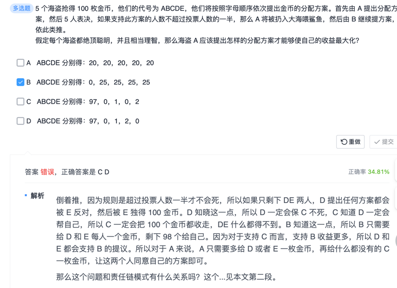

责任链模式小结

通过这个例子，我们已经了解到，责任链主要用于处理 职责相同，程度不同的类。

其主要优点有：

降低了对象之间的耦合度。在责任链模式中，客户只需要将请求发送到责任链上即可，无须关心请求的处理细节和请求的传递过程，所以责任链将请求的发送者和请求的处理者解耦了。
扩展性强，满足开闭原则。可以根据需要增加新的请求处理类。
灵活性强。可以动态地改变链内的成员或者改变链的次序来适应流程的变化。
简化了对象之间的连接。每个对象只需保持一个指向其后继者的引用，不需保持其他所有处理者的引用，这避免了使用众多的条件判断语句。
责任分担。每个类只需要处理自己该处理的工作，不该处理的传递给下一个对象完成，明确各类的责任范围，符合类的单一职责原则。不再需要 “项目经理” 来处理所有的责任分配任务。
但我们在使用中也发现了它的一个明显缺点，如果这个 bug 没人处理，可能导致 “程序员祭天” 异常。其主要缺点有：

不能保证每个请求一定被处理，该请求可能一直传到链的末端都得不到处理。
如果责任链过长，请求的处理可能涉及多个处理对象，系统性能将受到一定影响。
责任链建立的合理性要靠客户端来保证，增加了客户端的复杂性，可能会由于责任链拼接次序错误而导致系统出错，比如可能出现循环调用。
