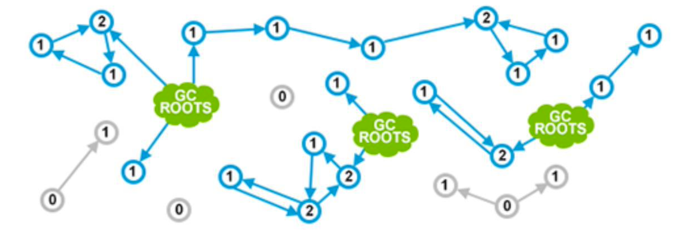

### Java垃圾回收
早期是手动回收：智能指针
自动内存管理Automated Memory Management：引用计数（Reference Counting）存在的问题是循环引用，造成内存泄露。

### java中的垃圾回收
#### 标记清除（Mark and Sweep）
JVM明确定义了什么是对象的可达性(reachability)，JVM
中有一类很明确很具体的对象, 称为垃圾收集根元素(Garbage Collection Roots),包括：
- 局部变量(Local variables) 
- 活动线程(Active threads)
- 静态域(Static fields)
JNI 引用(JNI references) 
- 其他对象
