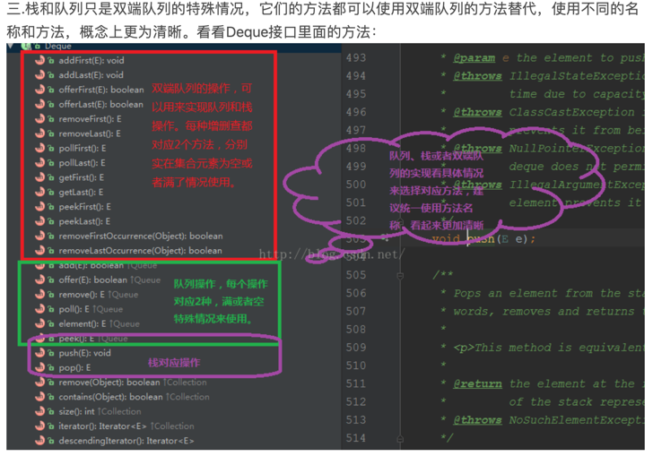

##刷题笔记



java中如果两个hashMap的key和value都逐一相等，则map1.equals(map2) 为true
```java
     public boolean equals(Object o) {
        if (o == this)
            return true;
        if (!(o instanceof Map))
            return false;
        Map<?,?> m = (Map<?,?>) o;
        if (m.size() != size())
            return false;
        try {
            Iterator<Entry<K,V>> i = entrySet().iterator();
            while (i.hasNext()) {
                Entry<K,V> e = i.next();
                K key = e.getKey();
                V value = e.getValue();
                if (value == null) {
                    if (!(m.get(key)==null && m.containsKey(key)))
                        return false;
                } else {
                    if (!value.equals(m.get(key)))
                        return false;
                }
            }
        } catch (ClassCastException unused) {
            return false;
        } catch (NullPointerException unused) {
            return false;
        }
        return true;
    }

```

求int[]中的最大值
```java
import java.util.Arrays;
import java.util.Collections;

public static int MAX(int[] arr) {
    Arrays.sort(arr);
    return arr[arr.length-1];
}

public static void main(String[] args) {
    Integer[] numbers = { 8, 2, 7, 1, 4, 9, 5};
    int min = (int) Collections.min(Arrays.asList(numbers));
    int max = (int) Collections.max(Arrays.asList(numbers));
    System.out.println("最小值: " + min);
    System.out.println("最大值: " + max);
}

public static int MAX(int[] arr) {
    return Arrays.Stream(arr).max().getAsInt();
}

```
集合框架
Collection
add
addAll
clear
contains
remove
size
toArray
Collection.sort(Collection c);
Collection.reverse(Collection c);

list
List<Object> list = new ArrayList<>();
list.add();
list.get(int index);
list.remove(int index);
list.indexOf(Object o);
list.subList(int start,int end);
list.toArray(new String[list.size()])；//集合转数组

Stack<Object> s = new Stack<>();
pop
peek
push


Queue<Object> q = new Queue<>();
q.offer(Object o);
q.peek;
q.poll;

Deque<String> dq = new LinkedList<>();
当栈用:
pop()
push()
peek()
当队列用:
offer()
poll()
peek()
从头部插入：
addFirst()//将指定的元素插入此双端队列的前面 ，空间不足抛异常
offerFirst()//空间不足插入失败返回回false
push()//空间不足抛异常
从尾部插入
add()//将指定的元素插入此双端队列的后面 ，空间不足抛异常
offer()//空间不足返回false
addLast()//同add()
offerLast()//同offer()
从头部删除：
E removeFirst()//检索并删除第一个元素，为空时抛出异常
E remove()//同removeFirst
E pop()//同removeFirst
E poll()//检索并删除第一个元素 ，为空时返回null
E pollFirst()//同poll
从尾部删除
E removeLast()//检索并删除最后一个元素，为空时抛出异常
E pollLast()//检索并删除最后一个元素 ，为空时返回null
检索但不删除
E getFirst()//检索但不删除第一个元素，为空就抛异常
E getLast()//检索不删除最后一个元素，为空就抛异常
E peek() peekFirst()//检索但不删除第一个元素，为空返回null
E peekLast()//检索但不删除最后一个元素，为空返回null
迭代器
Iterator<> iterator()

优先队列
Queue<Integer> q = new PriorityQueue<>();默认 小顶堆
peek()//不弹 返回队首元素
poll()//弹出 返回队首元素
add() offer() //添加元素,前者(add)在插入失败时抛出异常，后者(offer)则会返回false。
size()//返回队列元素个数
isEmpty()//判断队列是否为空，为空返回true,不空返回false

PriorityQueue<Integer> queue = new PriorityQueue<Integer>(new Comparator<Integer>() {
@Override
public int compare(Integer num1, Integer num2) {
return num1 - num2;//升序 小顶堆
return num2 - num1;//降序 大顶堆
}
});

get()
put()
remove()

getOrDefault(Object key,V defaultValue);
containsKey()
containValue()
isEmpty()

---------------------

前言

最近开始刷 LeetCode 算法题，针对工作需求的算法刷题其实主要是锻炼解决问题的思路和代码撰写能力，而不是像算法竞赛那样用复杂的数据结构，所以常用的数据结构和操作并不多，熟练使用也能很好地提升自己的代码质量，特此做一个整理，以便于查阅。

数据结构

数组 []

初始化

// 初始化一个大小为10，默认值为0的数组
int[] nums = new int[10];

// 初始化一个二位boolean数组
boolean[][] visited = new boolean[5][10];
常用方法

// 函数开头一般要做一个非空检查，然后用索引下标访问元素
if (nums.length == 0) {
return;
}

for (int i = 0; i < nums.length; i++) {
// 访问num[i]
}
字符串 String

初始化

String s1 = "hello world";
访问字符串

// String不支持用[]直接访问字符
char c = s1.charAt(2);
修改字符串

// String不支持直接修改字符串，要转化为char[]类型才能修改
char[] chars = s1.toCharArray();
chars[1] = 'a';
String s2 = new String(chars);
判断字符串是否相同

// 一定要用equals方法进行判断，不能直接用==
if (s1.equals(s2)) {
// 相等
} else {
// 不相等
}
拼接字符串

// 支持直接用+进行连接，但是效率不高
String s3 = s1 + "!";
通过 STRINGBUILDER 进行频繁的字符串拼接以提高效率

StringBuilder sb = new StringBuilder();

for (char c = 'a'; c <= 'f'; c++) {
// append方法支持拼接字符、字符串、数字等类型
sb.append(c);
String result = sb.toString();
}
动态数组 ArrayList

初始化

// 初始化一个存储String类型的动态数组
ArrayList<String> strings = new ArrayList<>();

// 初始化一个存储int类型的动态数组
ArrayList<Integer> nums = new ArrayList<>();
常用方法

// 判断是否为空
boolean isEmpty()

// 返回元素个数
int size()

// 访问索引元素
E get(int index)

// 在尾部添加元素
boolean add(E e)
双链表 LinkedList

初始化

// 初始化一个存储String类型的双链表
LinkedList<String> strings = new LinkedList<>();

// 初始化一个存储int类型的双链表
LinkedList<Integer> nums = new LinkedList<>();
常用方法

// 判断是否为空
boolean isEmpty()

// 返回元素个数
int size()

// 在尾部添加元素
boolean add(E e)

// 删除尾部最后一个元素
E removeLast()

// 在头部添加元素
void addFirst(E e)

// 删除头部第一个元素
E removeFirst()
哈希表 HashMap

初始化

// 初始化一个整数映射到字符串的哈希表
HashMap<Integer, String> map = new HashMap<>();

// 初始化一个字符串映射到数组的哈希表
HashMap<String, int[]> map = new HashMap<>();
常用方法

// 判断是否存在Key
boolean containsKey(Object key)

// 获取Key的对应Value，如果不存在则返回null
V get(Object key)

// 获取Key的对应Value，如果不存在则返回null
V getOrDefault(Object key, V defaultValue)

// 将Key和Value存入哈希表
V put(K key, V value)

// 将Key和Value存入哈希表，如果存在，则什么都不做
V putIfAbsent(K key, V value)

// 删除键值对并返回值
V remove(Object key)

// 获取哈希表中所有Key
Set<K> keySet()
队列 Queue

初始化

// Java中的Queue是一个接口
// 初始化一个存储String的队列
Queue<String> q = new LinkedList<>();
常用方法

// 判断是否为空
boolean isEmpty()

// 返回元素个数
int size()

// 返回队头元素
E peek()

// 删除并返回队头元素
E poll()

// 在队尾插入元素
boolean offer(E e)
堆栈 Stack

初始化

// 初始化一个int类型的堆栈
Stack<Integer> s = new Stack<>();
常用方法

// 判断是否为空
boolean isEmpty()

// 返回元素个数
int size()

// 将元素压入栈顶
E push(E e)

// 返回栈顶元素
E peek()

// 删除并的返回栈顶元素
E pop()
