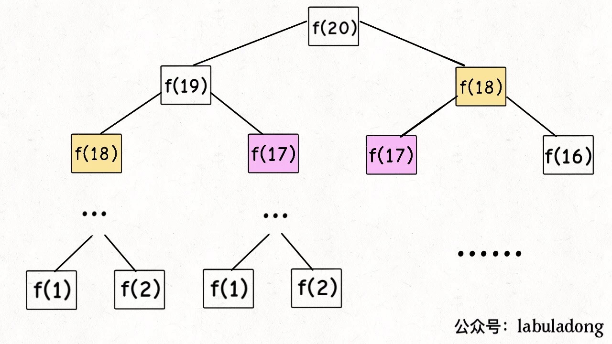
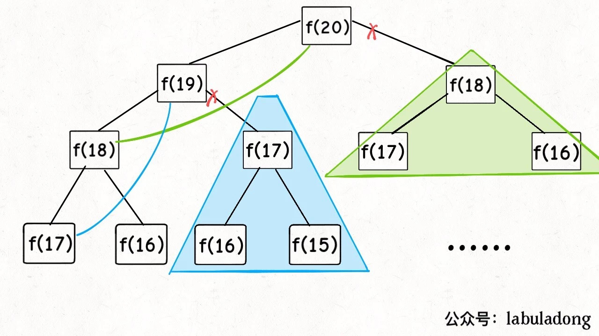
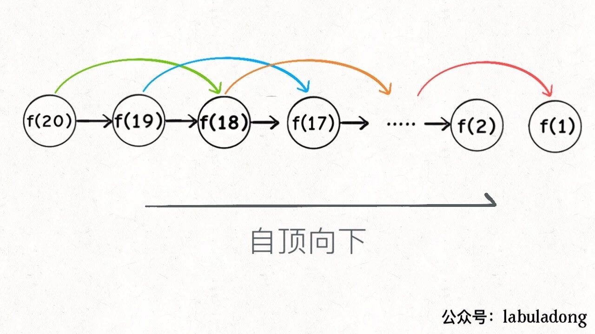
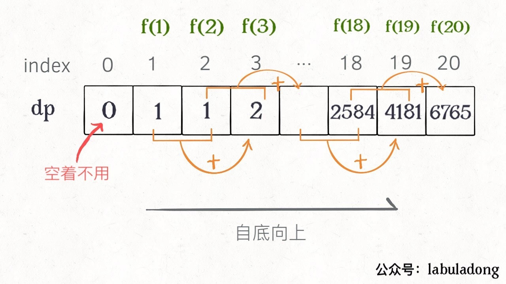

### 动态规划
> 动态规划问题的一般形式是求最值，如最长递增子序列、最小编辑距离。求解动态规划的核心问题是"穷举"。
> 动态规划的特点是存在重叠子问题，具备"最优子结构"，也就是通过子问题的最优值能得到原始问题的最值。
三要素
- 重叠子问题
- 最优子结构
- 状态转移方程（最困难）

#### 找出状态转移方程的关键思考点有如下几点：
- 问题的base case，也就是最简单的情况
- 问题中含有的状态
- 对于每个状态，可以作出何种选择使得状态发生改变
- 如何定义dp数组来表示"状态"和"选择"之间的关系，也就是找出函数表达式，即状态转移方程

#### 何为重叠子问题？
[leetcode 509 斐波那契数列问题](https://leetcode-cn.com/problems/fibonacci-number/)

```java
public int fib(int n) {
    if (n == 0) return 0;
    if (n == 1) return 1;
    return fib(n-1) + fib(n-2);
}
// 递归算法的度复杂度为O(2^n)
```

> 求解过程可以用一颗二叉树表示，从图中可以看出，算法低效的原因就是因为存在大量的重复计算，也就是重叠子问题。算法导论这本书里面就提到，解决重叠子问题的一种
> 方法就是可以通过一个备忘录来缓存已经计算过的子问题，这样在下次计算之前，可以先查询子问题是否已经被计算过，如果被计算狗，可以直接通过备忘录来直接获取。
```java
public int fib(int n) {
    if(n == 0) return 0;
    int[] memoCache = new int[n+1];

    return memoHelper(memoCache,n);

}
int memoHelper(int[] memoCache,int n) {
        if(n == 1 || n == 2) return 1;
        if(memoCache[n]!= 0 ) return memoCache[n];
        return  memoHelper(memoCache,n-1) + memoHelper(memoCache,n-2);
}

// 带备忘录的递归算法的度复杂度为O(n)
```


DP数组的迭代解法
```java
public int fib(int n) {
    if (n == 0) return 0;
    if (n == 1) return 1;
    int[] dp = new int[n+1];
    dp[1] = 1;
    dp[2] = 1;
    for(int i = 3; i <= n; i++) {
        dp[i] = dp[i-1] + dp[i-2];
    }

    return dp[n];
}
```
> 比较递归和dp数组的迭代解法可以看出，递归解法的一种自顶向下，而迭代是自底向上的。



#### 最优子结构
举一个例子：求全校的最高身高和最低身高，可以通过求每出每个班的最优身高和最低升高，然后计算出全校的最值。每个班级的最值是相互独立的。
但是如果要求全校学生身高的最大身高差，如果还是采用之前的每个班的身高差来求全校的，肯定是不对的。这种就不符合最优子结构问题，因为求全校的身高差，
每个班之间的身高差是有关联性的。
结论:可以从子问题的最优选择结果中推导出最大问题规模的最优选择结果，最优子结构之间是互相独立的。
### 动态规划进阶
- 求最优解(和最值的区别)
- 状态压缩，降低空间复杂度
#### Related question

- [leetcode 70. 爬楼梯](https://leetcode-cn.com/problems/climbing-stairs/)
- [53. 最大子序和](https://leetcode-cn.com/problems/maximum-subarray)
- [300. 最长递增子序列](https://leetcode-cn.com/problems/longest-increasing-subsequence/)


