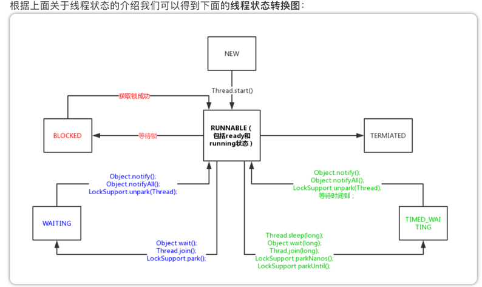

### 线程学习
http://concurrent.redspider.group/article/01/4.html

- sleep方法

sleep方法是Thread类的一个静态方法。它的作用是让当前线程睡眠一段时间。它有这样两个方法：
Thread.sleep(long)
Thread.sleep(long, int)

同样，查看源码(JDK 1.8)发现，第二个方法貌似只对第二个参数做了简单的处理，没有精确到纳秒。实际上还是调用的第一个方法。
这里需要强调一下：sleep方法是不会释放当前的锁的，而wait方法会。这也是最常见的一个多线程面试题。
它们还有这些区别：
  
- wait可以指定时间，也可以不指定；而sleep必须指定时间。
- wait释放cpu资源，同时释放锁；sleep释放cpu资源，但是不释放锁，所以易死锁。 
- wait必须放在同步块或同步方法中，而sleep可以再任意位置